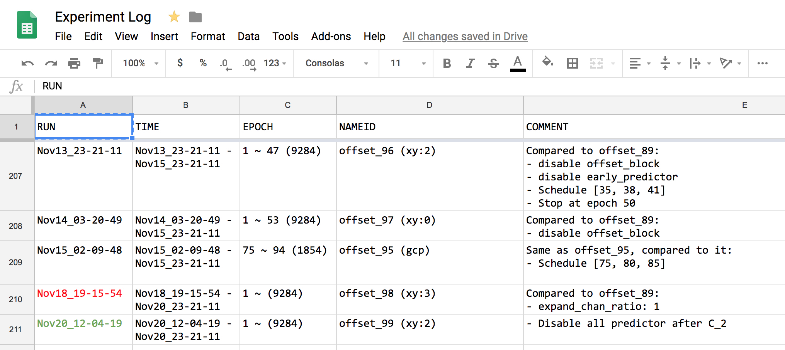
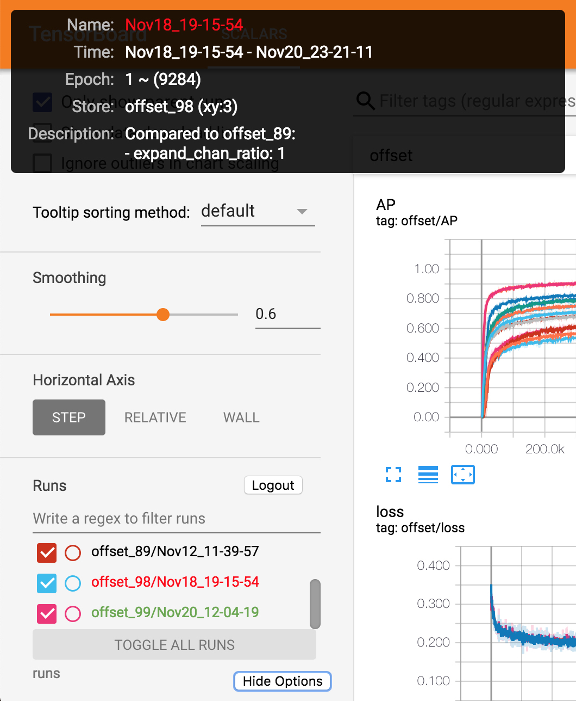

# Tensorboard Spreadsheet Helper

A tampermonkey script. Show your experiment log from Spreadsheet in Tensorboard.

## Log in Spreadsheet

## Tensorboard

# Usage

1. Obtain client id for your Google Spreadsheet account **from the Google API Console**. [Documentation](https://developers.google.com/identity/protocols/OAuth2)
    - Pay attention to the origin (domain and port) you are using for Tensorboard. For example, if I'm using `localhost` and `8889`, I should add one item to *Authorized JavaScript origins* with content `http://localhost:8889`. If you have multiple Tensorboards started, simply add all origins of them.
2. Obtain Spreadsheet id `XXX` of your file direcly from its edit URL: `https://docs.google.com/spreadsheets/d/XXX/edit`.
3. Copy code from `spreadsheet.js` to a new tampermonkey script.
4. Fill your client id, Spreadsheet id and sheet name in script. Sheet name is at lower left corner after you open the spreadsheet.
5. Replace domain and port in the line starting with `// @match`. If you have multiple ones, simply add a new line start with `// @match`.
6. Customize anything. If you want to change the form of your sheet, change the lines begining with comment *CUSTOMIZE HERE IF YOU WANT TO CHANGE SHEET FORM*
